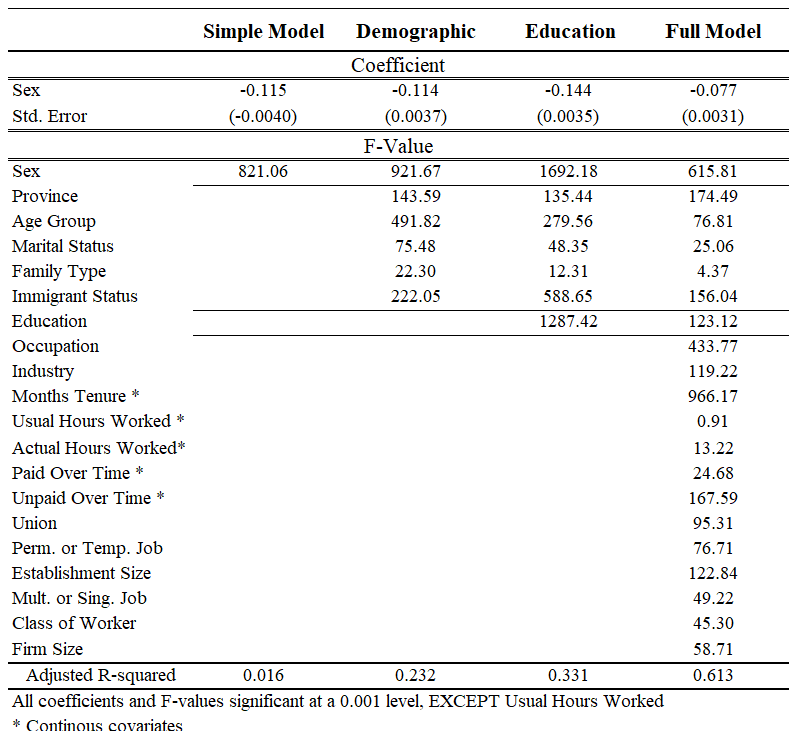

```{r setup, include=FALSE}
# knitr::opts_chunk$set(echo = TRUE)
knitr::opts_chunk$set(
  echo = FALSE,
  message = FALSE,
  warning = FALSE,
  error = FALSE, 
  out.width = "100%",
  fig.width = 3,
  fig.height = 2, 
  fig.retina = 3,
  cache = FALSE)
```


**Introduction:**

The gender wage gap is a well studied phenomenon in the modern labour market. [1] and [2] are good examples of studies conducted in the last 10 years within Canada. The core concept revolves around the idea that, on average, female workers receive lower compensation for performing the same job as their male counterparts. In 2018 it was estimated that women earned on average $0.87 for every dollar earned by man. This trend is exacerbated by the fact that female workers are consistently underrepresented in the top earning groups (10%), where there is a 3:1 ration of male to female workers in the first 9%, 5:1 ration in the next 0.9% and about 7:1 ration in the top 0.1% accourding to another study conducted in 2015. [1] 

Wage differentials are not uncommon and there are multiple factors that can affect how much an individual can expect to earn. Some of these factors include education (higher education is correlated with better wages), industry sector (private sector pays more than public), type of position (managerial vs service positions) etc. What we are trying to understand is whether gender is still significant even after we account for the other variables that are known to affect earnings.  

To answer this question, we will be turn towards the Labour Force Survey (LFS) of September 2022 from StatCan to see how prevalent this phenomenon is in 2022. Note that this is a cross sectional study which means it is just a snapshot look of the Canadian labour market. The results are only relevant to September 2022, and should not be extrapolated to other months or years without proper research. A larger study could be potentially conducted (as it was done in [2]), since the LFS does spanning multiple decades, but this is out of the scope of the project [3].

\newpage

**Data:**

LFS is a mandatory survey as described in the Statistics Act which alleviates some of the concerns of sampling bias. The samples are collected so they are representative of each province and their subsequent geographic area. Within the area, household are randomly selected and individual of age 15 and above are selected to participate. Each survey holds around 56'000 households and 100'000 individuals. StatCan mentions that they exclude some territories with very sparse populations, but this only account for 2% of the entire Canadian population age 15 and above. Example of such exclusion are aboriginal settlements, Canadian armed forces, etc.

The survey is confidential but they ask for demographic characteristic such as age, sex, as well as occupation and industry, among other things. The bulk of the survey asks about hours worked, average wages, number of days unemployed, etc. That being said, some information is censored if they believe it can be used to identify certain individuals from the survey. For examples, there might be an un-named individual living in Vancouver earning upwards of 10 million dollars a year, since there is just a handful of such individuals. Combining this unique earning information with other characteristics such as sex and occupation, one could potentially identify the person being surveyed, which violates the confidential nature of the LFS survey. 

Our dataset consist of 110'440 observations and 60 variables, but we are only interested in the subset that are employed, which cuts down the dataset to 60,151 individuals. 

The response is a continuous variable, it represents the hourly wages of a given individual ($). There are quite a bit of missing values (8369 NAs). After conducting some data analysis on the missing data  (Appendix I), we see it doesn't deviate too much from the bigger sample, so I decided to drop the NA's. This leaves us with 51782 observations.

The variables "Age of youngest child" and "current student status" contain some missing values. I have decided to drop them since they do not significantly change the model when I include them (Appendix IV).
\newpage
**Explanatory Data Analysis:**

```{r}
library(data.table)
data <- data.frame(fread('https://raw.githubusercontent.com/AlisaYang07/TEST_Dataset/main/pub0922.csv'))# 
```
```{r}
employed_data = data[(data$LFSSTAT)==1,] ##Status = Employed(1) or Employed on leave(2)

keep<- c("PROV","HRLYEARN","SEX", "AGE_12","MARSTAT","EDUC","MJH","COWMAIN","IMMIG","NAICS_21","UTOTHRS","ATOTHRS","PAIDOT","UNPAIDOT", "NOC_40","NOC_10","TENURE","UNION","PERMTEMP", "ESTSIZE","FIRMSIZE","EFAMTYPE")

employed_data = employed_data[,(names(employed_data ) %in% keep)]
employed_data = employed_data[!is.na(employed_data$HRLYEARN),]
#employed_data[is.na(employed_data)] <- 999
```

```{r fig.height = 7, fig.width = 6}
library(ggpubr)
library(ggplot2)
library(dplyr)
library(stringr)

data_summary <- function(data, varname, groupnames){
  require(plyr)
  summary_func <- function(x, col){
    c(mean = mean(x[[col]], na.rm=TRUE),
      sd = sd(x[[col]], na.rm=TRUE))
  }
  data_sum<-ddply(data, groupnames, .fun=summary_func,
                  varname)
  data_sum <- rename(data_sum, c("mean" = varname))
 return(data_sum)
}


employed_data$hrlwages <- employed_data$HRLYEARN / 100
employed_male <- subset(employed_data, SEX == 1)
employed_female <- subset(employed_data, SEX == 2)
male_mean = mean(employed_male$hrlwages,na.rm=TRUE)
female_mean= mean(employed_female$hrlwages,na.rm=TRUE)
employed_data$labels <- ifelse(employed_data$SEX == 1, "Male", "Female")
df<- data.frame(employed_data)

library(plyr)

p <- ggplot(df, aes(x=hrlwages)) + 
  geom_histogram(aes(color = labels, fill = labels),alpha = 0.4, position = "identity",size=0.25) +
  scale_fill_manual(values = c("#bb001c", "#0051bb")) +
  scale_color_manual(values = c("#bb001c", "#0051bb")) +
  annotate(geom = "vline",
             x = c(male_mean,  female_mean),
             xintercept =c(male_mean,  female_mean),
             linetype = c("dashed", "dashed"),
           color = c("#0051bb", "#bb001c"),size=0.25) +
  annotate(geom = "text",
             label = c(format(round(male_mean, 2), nsmall = 2),
                       format(round(female_mean, 2), nsmall = 2)),
             x = c(male_mean, female_mean),
             y = c(3000, 3000),
             angle = 90, 
             vjust = 1,
           size=2
           )+ 
  ggtitle("Average Male vs Female Hourly Wages") +
  xlab("$ Hourly Wages") + ylab("# of Individuals")+
  theme(
         panel.background = element_rect(fill='transparent'),
         plot.background = element_rect(fill='transparent', color=NA),
         panel.grid.major = element_blank(),
         panel.grid.minor = element_blank(),
         legend.background = element_rect(fill='transparent'),
         legend.box.background = element_rect(fill='transparent'),
         text = element_text(size = 7),
         legend.position = "none",
         plot.title = element_text(size=10)
         
       )

df=df %>%
  mutate(NOC_10_occupation = case_when(
    NOC_10==1	~ "Manage.",
    NOC_10==2	~ "Business",
    NOC_10==3	~ "Sciences",
    NOC_10==4	~ "Health",
    NOC_10==5	~ "Education and government ",
    NOC_10==6	~ "Art and sport",
    NOC_10==7	~ "Sales and service",
    NOC_10==8	~ "Trades and Construction",
    NOC_10==9	~ "Natural resources and agriculture",
    NOC_10==10	~ "Manufac. and Utilities",
    ))
df$NOC_10_occupation =str_wrap(df$NOC_10_occupation,width = 6)


occupatio_bar_graph <-
  ggplot(df, mapping = aes(x = NOC_10_occupation)) +
  geom_bar(aes(color = labels, fill = labels),alpha = 0.4,position = "dodge",size=0.25)+
  scale_fill_manual(values = c("#bb001c", "#0051bb")) +
  scale_color_manual(values = c("#bb001c", "#0051bb")) +
  theme(
         panel.background = element_rect(fill='transparent'),
         plot.background = element_rect(fill='transparent', color=NA),
         panel.grid.major = element_blank(),
         panel.grid.minor = element_blank(),
         legend.background = element_rect(fill='transparent'),
         legend.box.background = element_rect(fill='transparent'),
         text = element_text(size = 7),
        # legend.position="bottom"
        legend.position = "none",
        plot.title = element_text(size=10),
        axis.text = element_text(size = 4) 
       )+
  ggtitle("Occupation by Sex") +
  xlab("Occupations NOC 10") + ylab("# of Individuals")

occupation_df <- data_summary(df, varname="hrlwages", 
                    groupnames=c("NOC_10_occupation", "labels"))

occupatio_bar_graph_wage<-
   ggplot(df) + 
  geom_bar(aes(x=as.factor(NOC_10_occupation),y=hrlwages, fill=labels,color = labels),
           position = "dodge", stat = "summary", fun.y = "mean",alpha = 0.4,size=0.25)+
  
  scale_fill_manual(values = c("#bb001c", "#0051bb")) +
  scale_color_manual(values = c("#bb001c", "#0051bb")) +
  theme(
         panel.background = element_rect(fill='transparent'),
         plot.background = element_rect(fill='transparent', color=NA),
         panel.grid.major = element_blank(),
         panel.grid.minor = element_blank(),
         legend.background = element_rect(fill='transparent'),
         legend.box.background = element_rect(fill='transparent'),
         text = element_text(size = 7),
        # legend.position="bottom"
        legend.position = "none",
        plot.title = element_text(size=10),
        axis.text = element_text(size = 4) 
       )+
  annotate(geom = "hline",
             y = c(male_mean,  female_mean),
             yintercept =c(male_mean,  female_mean),
             linetype = c("dashed", "dashed"),
           color = c("#0051bb", "#bb001c"),size=0.25) +
  annotate(geom = "text",
             label = c(format(round(male_mean, 2), nsmall = 2),
                       format(round(female_mean, 2), nsmall = 2)),
             y = c(male_mean-1, female_mean-1),
             x = c(2, 2),
             angle = 0, 
           size=2
           )+
  ggtitle("Occupation by Sex") +
  xlab("Occupations") + ylab("$ Avg. Hourly Wages")


df=df %>%
  mutate(EducationLevel = case_when(
    EDUC==0	~ "0 to 8 years",
    EDUC==1	~ "Some High School",
    EDUC==2	~ "High School",
    EDUC==3	~ "Some postsec.",
    EDUC==4	~ "Certificat/Diploma",
    EDUC==5	~ "Bachelor's",
    EDUC==6	~ "Above",
    ))

df$EducationLevel =str_wrap(df$EducationLevel,width = 6)


education_bar_graph_wage<-
 ggplot(df) + 
  geom_bar(aes(x=as.factor(EducationLevel),y=hrlwages, fill=labels,color = labels),
           position = "dodge", stat = "summary", fun.y = "mean",alpha = 0.4,size=0.25)+
  scale_fill_manual(values = c("#bb001c", "#0051bb")) +
  scale_color_manual(values = c("#bb001c", "#0051bb")) +
  theme(
         panel.background = element_rect(fill='transparent'),
         plot.background = element_rect(fill='transparent', color=NA),
         panel.grid.major = element_blank(),
         panel.grid.minor = element_blank(),
         legend.background = element_rect(fill='transparent'),
         legend.box.background = element_rect(fill='transparent'),
         text = element_text(size = 7),
        # legend.position="bottom"
        legend.position = "none",
        plot.title = element_text(size=10),
        axis.text = element_text(size = 4) 
       )+
  annotate(geom = "hline",
             y = c(male_mean,  female_mean),
             yintercept =c(male_mean,  female_mean),
             linetype = c("dashed", "dashed"),
           color = c("#0051bb", "#bb001c"),size=0.25) +
  annotate(geom = "text",
             label = c(format(round(male_mean, 2), nsmall = 2),
                       format(round(female_mean, 2), nsmall = 2)),
             y = c(male_mean-1, female_mean-1),
             x = c(2, 2),
             angle = 0, 
           size=2
           )+
  ggtitle("Education by Sex") +
  xlab("Education Level") + ylab("$ Avg. Hourly Wages")

educ_bar_graph <-
  ggplot(df, mapping = aes(x = EducationLevel)) +
  geom_bar(aes(color = labels, fill = labels),alpha = 0.4,position = "dodge",size=0.25)+
  scale_fill_manual(values = c("#bb001c", "#0051bb")) +
  scale_color_manual(values = c("#bb001c", "#0051bb")) +
  theme(
         panel.background = element_rect(fill='transparent'),
         plot.background = element_rect(fill='transparent', color=NA),
         panel.grid.major = element_blank(),
         panel.grid.minor = element_blank(),
         legend.background = element_rect(fill='transparent'),
         legend.box.background = element_rect(fill='transparent'),
         text = element_text(size = 7),
        # legend.position="bottom"
        legend.position = "none",
        plot.title = element_text(size=10),
        axis.text = element_text(size = 4) 
       )+
  ggtitle("Education Attainment by Sex") +
  xlab("Years of Education") + ylab("# of Individuals")

df=df %>%
  mutate(AgeGroup = case_when(
    AGE_12==1	~ "15-19",
    AGE_12==2	~ "20-24",
    AGE_12==3	~ "25-29",
    AGE_12==4	~ "30-34",
    AGE_12==5	~ "35-39",
    AGE_12==6	~ "40-44",
    AGE_12==7	~ "45-49",
    AGE_12==8	~ "50-54",
    AGE_12==9	~ "55-59",
    AGE_12==10	~ "60-64",
    AGE_12==11	~ "65-69",
    AGE_12==12	~ "70+",
    ))
df$AgeGroup=str_wrap(df$AgeGroup,width = 6)

age_graph <-
  ggplot(df) + 
  geom_bar(aes(x=as.factor(AgeGroup),y=hrlwages, fill=labels,color = labels),
           position = "dodge", stat = "summary", fun.y = "mean",alpha = 0.4,size=0.25)+
  scale_fill_manual(values = c("#bb001c", "#0051bb")) +
  scale_color_manual(values = c("#bb001c", "#0051bb")) +
  theme(
         panel.background = element_rect(fill='transparent'),
         plot.background = element_rect(fill='transparent', color=NA),
         panel.grid.major = element_blank(),
         panel.grid.minor = element_blank(),
         legend.background = element_rect(fill='transparent'),
         legend.box.background = element_rect(fill='transparent'),
         text = element_text(size = 7),
        # legend.position="bottom"
        legend.position = "none",
        plot.title = element_text(size=10),
        axis.text = element_text(size = 4) 
       )+
  annotate(geom = "hline",
             y = c(male_mean,  female_mean),
             yintercept =c(male_mean,  female_mean),
             linetype = c("dashed", "dashed"),
           color = c("#0051bb", "#bb001c"),size=0.25) +
  annotate(geom = "text",
             label = c(format(round(male_mean, 2), nsmall = 2),
                       format(round(female_mean, 2), nsmall = 2)),
             y = c(male_mean-1, female_mean-1),
             x = c(2, 2),
             angle = 0, 
           size=2
           )+
  ggtitle("Age Group by Sex") +
  xlab("Age Group") + ylab("$ Avg. Hourly Wages")

df=df %>%
  mutate(ImmigrationStatus = case_when(
    IMMIG==1	~ "<10 years",
    IMMIG==2	~ ">10 years",
    IMMIG==3	~ "Non-Immigrant",
    ))

imm<-ggplot(df) + 
  geom_bar(aes(x=as.factor(ImmigrationStatus),y=hrlwages, fill=labels,color = labels), 
           position = "dodge", stat = "summary", fun.y = "mean",alpha = 0.4,size=0.25)+
  scale_fill_manual(values = c("#bb001c", "#0051bb")) +
  scale_color_manual(values = c("#bb001c", "#0051bb")) +
  annotate(geom = "hline",
             y = c(male_mean,  female_mean),
             yintercept =c(male_mean,  female_mean),
             linetype = c("dashed", "dashed"),
           color = c("#0051bb", "#bb001c"),size=0.25) +
  annotate(geom = "text",
             label = c(format(round(male_mean, 2), nsmall = 2),
                       format(round(female_mean, 2), nsmall = 2)),
             y = c(male_mean-1, female_mean-1),
             x = c(1, 1),
             angle = 0, 
           size=2
           )+
  theme(
         panel.background = element_rect(fill='transparent'),
         plot.background = element_rect(fill='transparent', color=NA),
         panel.grid.major = element_blank(),
         panel.grid.minor = element_blank(),
         legend.background = element_rect(fill='transparent'),
         legend.box.background = element_rect(fill='transparent'),
         text = element_text(size = 7),
        # legend.position="bottom"
        legend.position = "none",
        plot.title = element_text(size=10),
        axis.text = element_text(size = 4) 
       )+
  ggtitle("Immigration Status by Sex") +
  xlab("Immigration Status") + ylab("$Avg. Hourly Wages")

df=df %>%
  mutate(Class_of_Worker = case_when(
    COWMAIN==1	~ "Public Sector",
    COWMAIN==2	~ "Private Sector",
    COWMAIN==3	~ "Self-Employed Inc.+PaidHelp",
    COWMAIN==4	~ "Self-Employed Inc.+NoPaidHelp",
    COWMAIN==5	~ "Self-Employed UnInc.+PaidHelp",
    COWMAIN==6	~ "Self-Employed UnInc.+NoPaidHelp",
    COWMAIN==7	~ "Unpaid Family Worker",
    ))

df$Class_of_Worker=str_wrap(df$Class_of_Worker,width = 6)


class_workers<- ggplot(df, mapping = aes(x = Class_of_Worker)) +
  geom_bar(aes(color = labels, fill = labels),alpha = 0.4,position = "dodge",size=0.25)+
  scale_fill_manual(values = c("#bb001c", "#0051bb")) +
  scale_color_manual(values = c("#bb001c", "#0051bb")) +
  theme(
         panel.background = element_rect(fill='transparent'),
         plot.background = element_rect(fill='transparent', color=NA),
         panel.grid.major = element_blank(),
         panel.grid.minor = element_blank(),
         legend.background = element_rect(fill='transparent'),
         legend.box.background = element_rect(fill='transparent'),
         text = element_text(size = 7),
        # legend.position="bottom"
        legend.position = "none",
        plot.title = element_text(size=10),
        axis.text = element_text(size = 4) 
       )+
  ggtitle("Class of Worker by Sex") +
  xlab("Worker Class") + ylab("# of Individuals")


df=df %>%
  mutate(Marital_Status = case_when(
    MARSTAT==1	~ "Married",
    MARSTAT==2	~ "Common-Law",
    MARSTAT==3	~ "Widowed",
    MARSTAT==4	~ "Separated",
    MARSTAT==5	~ "Divorced",
    MARSTAT==6	~ "Single",
    ))

marital_status <-ggplot(df) + 
  geom_bar(aes(x=as.factor(Marital_Status),y=hrlwages, fill=labels,color = labels), 
           position = "dodge", stat = "summary", fun.y = "mean",alpha = 0.4,size=0.25)+
  scale_fill_manual(values = c("#bb001c", "#0051bb")) +
  scale_color_manual(values = c("#bb001c", "#0051bb")) +
  annotate(geom = "hline",
             y = c(male_mean,  female_mean),
             yintercept =c(male_mean,  female_mean),
             linetype = c("dashed", "dashed"),
           color = c("#0051bb", "#bb001c"),size=0.25) +
  annotate(geom = "text",
             label = c(format(round(male_mean, 2), nsmall = 2),
                       format(round(female_mean, 2), nsmall = 2)),
             y = c(male_mean-1, female_mean-1),
             x = c(5, 5),
             angle = 0, 
           size=2
           )+
  theme(
         panel.background = element_rect(fill='transparent'),
         plot.background = element_rect(fill='transparent', color=NA),
         panel.grid.major = element_blank(),
         panel.grid.minor = element_blank(),
         legend.background = element_rect(fill='transparent'),
         legend.box.background = element_rect(fill='transparent'),
         text = element_text(size = 7),
        # legend.position="bottom"
        legend.position = "none",
        plot.title = element_text(size=10),
        axis.text = element_text(size = 4) 
       )+
  ggtitle("Marital Status by Sex") +
  xlab("Marital Status") + ylab("$ Avg. Hourly Wages")

df$Class_of_Worker=str_wrap(df$Class_of_Worker,width = 6)


ggarrange(p, occupatio_bar_graph_wage,
          education_bar_graph_wage, age_graph,
          imm,marital_status,
          labels = c("A", "B", "C","D","E","F"),
          ncol = 2, nrow = 3)
```

Looking at Figure 1-A and we notiece that there is difference in the wages wages for male and female workers. On average male workers earn 33.08 dollars an hour vs female workers that only earn 29.30 dollars an hour. This translates to female workers only earning $0.88 for every dollar a man makes. This is not far from the statistics reported in [1] where every female worker earned only 0.87 cents for every dollar earned by their male counterpart. 

We also can see that in B, managerial occupations have the highest earning followed by the occupations in the sciences. Job paying the least are the ones in sales and services. If we look at Appendix 3. we can also see the certain occupations are predominantly male vs female, where trade and managerial occupations tend to be much more biased towards male while health business are more female biased. This bias in occupation might explain some of the effects of gender wage gap. 

Occupation is broken down into 10 main group under the Canadian National Occupational Classification (NOC) and there are multiple levels of granularity, the coarsest one contains 10 categories but at the most granular levels of the NOC classification has 40 different occupation categories. There are some coarser categories can be made up of very different occupation categories, for example both a police officer and a professor fall within the "Education and Government" category. Which means even within the same occupation classification there are vastly different wages ranges. (This is why in the statistical analysis part of this report we will use the variable NOC 40 as a independent variable instead of NOC 10)

As expected in section C, we see that individuals above 35 but below 60 years old tend to earn more, but what is surprising is that the difference between male and female wages is almost irrelevant in the early year (between 15-30), but much more pronounced later in life. This might be because female workers tend to have more pronounced leaves of absence (maternal leaves) to support a family, but we would need more information to be sure. This is out of scope for the project but an interesting thing to look into in the future.

In part E, we see that immigrants with more than 10 years living in Canada earn above the average while immigrant with less than 10 years earn below average, but both immigrant types are a small portion of the whole sample population as seen in Appendix 3. 

What is important to notice is that the wage differential is always present. The red bar, signifying the female workers average wage, is always lower than the male counterpart. This a strong indication that gender will play a significant role in explaining the difference in wages even accounting for other explanatory variables. To see whether these effects are significant, we will do some statistical analysis in the next section. 

**Models and Analysis**

For the model selection, we will use a linear regression with multiple explanatory variables since each observation is independent from each other (we make this assumption because LFS is a mandatory survey so there it is less likely to suffer from sampling bias). Since the data set is very big, it will give us very small p-values, which does not tell use much apart from a certain variable being statistically significant. What we will look at instead is an analysis of variance (ANOVA). 

One of the first things we need to do is normalize the data. We tend to have a left skew in wage data since there are a sizable amount of individuals with very high wages. After applying a log transformation it, it looks more normal (Appendix II). None of the other models make much sense (Poisson, Weibull, exponential, etc.) since the data is normal and continuous.

For the selection of the explanatory variables, we will ignore all of the ones related to unemployment since our response variable is hourly wages. Example of these are "Duration of unemployment (weeks)" or "Unemployed, type of job wanted". Some other variables that we exclude automatically are the ones that are highly correlated to each other, such as AGE_6 and AGE_12. The first represents 6 category of ages and the latter is 12 group categories. The only difference between the two is the granularity of the measurement. Another such variable is NOC_10 and NOC_40; as previously mentioned, these measure the same thing, occupation, but we will use NOC_40 since it contains more information. 

This leaves us with 20 dependent variables. We could include all of them in one go, but this is not very informative. Instead, we wil run some nested models. We start off with the simplest of model, which is just $\text{log(hourly-wages)} = \beta_0 + \beta_1(Sex)$. Then we will add the demographic characteristics $\text{log(hourly-wages)} = \beta_0 +\beta_1(Sex) +  \beta_2(Province) ...+  \beta_6(Imm Status)$ followed by the educational characteristics $\text{log(hourly-wages)} = \beta_0 + \beta_1(Sex) +  \beta_2(Province) ...+  \beta_6(Imm Status) +  \beta_7(Education)$ and finally the job characteristics. $\text{log(hourly-wages)} = \beta_0 + \beta_1(Sex) +  \beta_2(Province)+...+\beta_6(Immigration Status) +  \beta_7(Education)+ ...+ \beta_8(Occupations_40)+ ....+\beta_{20}(FirmSize)$ giving us the full model.

What we are trying to achieve here is to see how the coefficient for sex changes as we control for different group of variables (demographic, education, etc.). Since we did a log transform on the dependent variable, the coefficients have a multiplicative effect. $hourly-wages = exp(\beta_0 + \beta_1x..)$.[4]

Another things to report is the F-value. $F = \frac{(TSS-RSS)/(p-1)}{RSS/(n-p)}$, where TSS is total sum of squares corrected for the mean and the RSS is the residual sum of squares. If F is close to its critical value (depends on the degrees of freedom), we do not expect that new parameters to be significant. F-value will be a indicator of what covariates are taking up most of the variance. R default to using sequential analysis of variance, meaning F-values will differ depending in the order we introduce them, which we do not want, so we use Type III since this calculates the F-values accounting for all other covariates[5].
\newpage
**Results:**

```{r fig.align="center"}

```

Table1. Upper portion: coefficient estimate for male vs female log hourly wages controlling for multiple demographic, educational and employment covariates. Lower portion: ANOVA Type III F-values.

Taking a look at the estimated coefficient for sex we see it does not change much after accounting for demographic covariates. The coefficient in the simple model is -0.115314, which means in general female works earn 11% less compared to their male workers ((exp(-0.115314)-1)=-10.89). This is exacerbated when we include demographic and education covariates, where we expect female workers to earn around 13.5% less than their male counterpart, but this is reduced to -7.43% when we account for work related covariates, and all of these coefficients are significant at a p-value of 0.001. This suggest that gender plays a big role on the expected wages, even after accounting for demographic, education and work covariates. 

If we look at the ANOVA, some of the covariate that explain most of the variation in wages are sex, age group, education, tenure (how long they have stayed at the company) and the type of occupation. What is also interesting to see is that immigrant status, union industry, and the size of the work establishment also plays an important role on the expected wages. 

Something to point out is that all of the values are statistically significant, but that is due to the huge sample size, and results should be taken with a grain of salt. Statistically significant does not always mean the actual effect is big. We should also notice that we have an adjusted R-squared of 0.613 in the full model, which suggest a decent size of the the variation in the wages can be explained by demographic, educational, and work related covariates.

```{r fig.height = 3, fig.width = 6}
library(car)
employed_data$log_hrlwages <- log(employed_data$hrlwages)

fit_vanilla = lm(log_hrlwages~as.factor(SEX),data=employed_data)

fit_demographic =lm(log_hrlwages~as.factor(SEX)+as.factor(PROV)+as.factor(AGE_12)+as.factor(MARSTAT)+as.factor(EFAMTYPE)+as.factor(IMMIG)
                    ,data=employed_data)


fit_education =lm(log_hrlwages~as.factor(SEX)+as.factor(PROV)+as.factor(AGE_12)+as.factor(MARSTAT)+as.factor(EFAMTYPE)+as.factor(IMMIG) +as.factor(EDUC) ,data=employed_data)

full =lm(log_hrlwages~as.factor(SEX)+as.factor(PROV)+as.factor(AGE_12)+as.factor(MARSTAT)+as.factor(EFAMTYPE)+as.factor(IMMIG) +as.factor(EDUC)+ as.factor(NOC_40)+as.factor(NAICS_21)+TENURE+ UTOTHRS+ATOTHRS+PAIDOT+UNPAIDOT+as.factor(UNION)+ as.factor(PERMTEMP) + as.factor(ESTSIZE) +as.factor(MJH)+as.factor(COWMAIN) +as.factor(FIRMSIZE),data=employed_data)

#summary(fit_vanilla)
#summary(fit_demographic)
#summary(fit_education)
#summary(full)
#Anova(fit_vanilla,type="III")
#Anova(fit_demographic,type="III")
#Anova(fit_education,type="III")
#Anova(full,type="III")


res <- resid(full)

plot(fitted(full), res, main="Fitted vs Residuals",
        xlab="Fitted",
        ylab="Residual")

#add a horizontal line at 0 
abline(0,0)

qqnorm(res)
qqline(res) 
```

Looking at the residual plots we expect to see the datapoints of the fitted vs the residual plot to be evenly dispersed along the horizontal line. If we see weird patterns (such as a quadratic curve) we would be worried that the data is not normal. In our case it is hard to see because of the huge amount of datapoints, but they do seem to fall on the horizontal line in general. In the Q-Q plots, we should see it follow the diagonal line. In our case, the left hand side drop away from the idea Q-Q line, which suggest that there is a left skewedness in the data. The Q-Q plot had a right skewedness (the right hand side dropped away from the idea Q-Q lines) when I applied the model in the original wage scale. This is because wages are well known to be a skewed variable, were we have very few people with very high wages, but after applying the log transformation we have the opposite problem. The data might slightly left skewed, so the log might have been to strong. 

**Conclusions:**

We see that there is still gender wage gap in Canada for September 2022. We find that after accounting for educational, demographic and work related covariates, we estimate that female workers earn 7% than their male counterpart. We also see that a great deal of variation in the wages are due to education, age, and months working at the current job. This analysis just scratches at the surface of the issue, there is so much further work that can be done. For example, we can add a time component to the analysis since the labour market fluctuates in a cyclical manner with booms and recessions. Since our dataset is so big, we could also focus on subgroup analysis. It might be interesting to look into the estimate of wages within province, occupation, industry, etc. which would give a more detailed view and could potentially identify sectors where the wage differential is strongest.  

**References:**

[1]R. Pelletier, M Patterson, and M. Moyser, "The Gender Wage Gap in Canada: 1998 to 2018," in 3rd Annual Forum on Measuring identities: Inclusion Gatineau, Quebec, November 21-22, 2019. URL:https://acs-aec.ca/wp-content/uploads/2019/12/F1-Women-in-Labour-Market-Stat-Can.pdf

[2]A. Bonikowska, "Earnings Inequality and the Gender Pay Gap in Canada: The Role of Women’s
Under-representation Among Top Earners," in Economic insights, March 7, 2019, URL: https://epe.lac-bac.gc.ca/100/201/301/weekly_acquisitions_list-ef/2019/19-10/publications.gc.ca/collections/collection_2019/statcan/11-626-x/11-626-x2019002-eng.pdf

[3] Statistics Canada. "Labour Force Survey (LFS)". September, 2022, URL: https://www23.statcan.gc.ca/imdb/p2SV.pl?Function=getSurvey&SDDS=3701

[4] University of Virginia "Interpreting Log Transformations in a Linear Model" https://data.library.virginia.edu/interpreting-log-transformations-in-a-linear-model/#
:~:text=Interpret%20the%20coefficient%20as%20the,variable%20increases
%20by%20about%200.20%25. (Accessed December 14, 2022)

[5]J.J. Faraway, *Linear Models with R*, 2nd Edition, Chapman & Hall, 2014.
